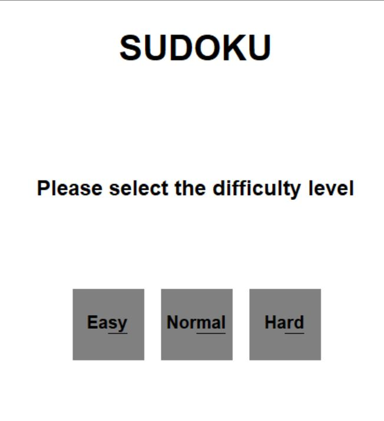
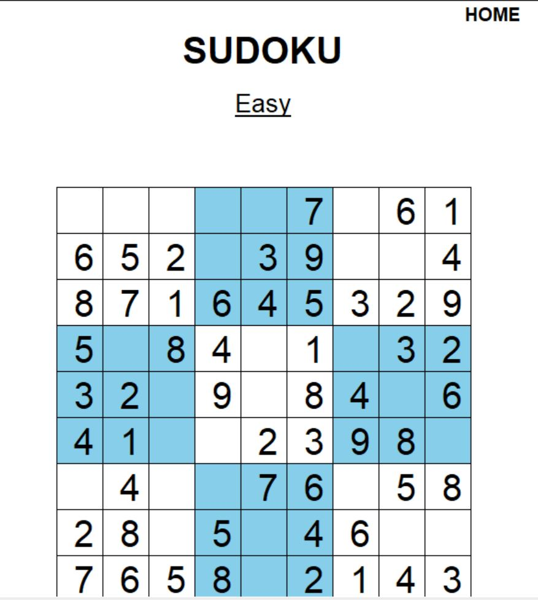
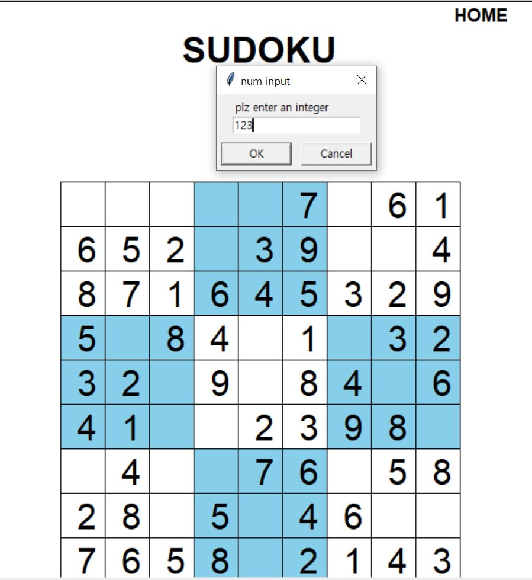

# OSS-9's Project : `Free-python-games`
 
[&#9989;GO STATIC PAGE](https://20-2-skku-oss.github.io/2020-2-OSS-9/) 
[&#9989;GO Free-python-games](https://github.com/20-2-SKKU-OSS/free-python-games)

**OSS-9의 프로젝트는 `free python games`에 기여하는 것입니다. `Free Python Games` 는 교육과 놀이를 목적으로 하는 파이썬 게임 모음입니다. 이 게임은 간단한 파이썬 코드로 제작된 미니 게임, 고전 게임들로 구성되어 있습니다. 
Team OSS-9은 이 게임에 새로운 게임인 `스도쿠`를 추가하여 Free Python Games의 개발자에게 pull request하여 Free Python Games에 기여하는 것을 목표로 합니다. :smile:**

## [게임 소개]
**당신은 이 게임으로 간단한 `9X9 스도쿠 퍼즐`을 즐길 수 있습니다. 스도쿠는 18세기 수학자 `오일러`가 창안한 빈칸에 1~9까지의 숫자를 채우는 게임입니다. 
이 게임은 `블랙 앤 화이트 테마`로 구성되어 있고 `Easy, Normal, Hard`의 세가지 난이도 설정이 가능합니다. 세 개의 난이도는 모두 랜덤으로 숫자를 생성하고 랜덤으로 빈칸을 만듭니다. 플레이어는 Easy, Normal, Hard 버전에서 각각 27개, 36개, 45개의 빈칸을 채워야하고 빈칸을 모두 채우면 게임은 플레이어의 승리로 끝납니다.**

## [조작법]
### 1. 메인 화면에서 난이도를 선택합니다.

### 2. 빈칸을 클릭합니다.

### 3. 화면에 1부터 9까지의 숫자 중 하나를 쓰고 OK를 누릅니다.

### 4. 숫자가 입력된 것을 확인한 후 게임을 계속 진행합니다.

## [OUR TEAM]
Our team is made of 6 members&#9996;.  
&#9989;[Kim Sang-hun](https://github.com/baldwinIV) 
&#9989;[Gil Eun-ji](https://github.com/EunJiGil) 
&#9989;[Lee Eun-ji](https://github.com/eunji0123) 
&#9989;[Seo Han-gyeol](https://github.com/Seo-han-gyeol) 
&#9989;[Jeong Seok-jun](https://github.com/June1010) 
&#9989;[Park Yun-jin](https://github.com/younjin0520) 
